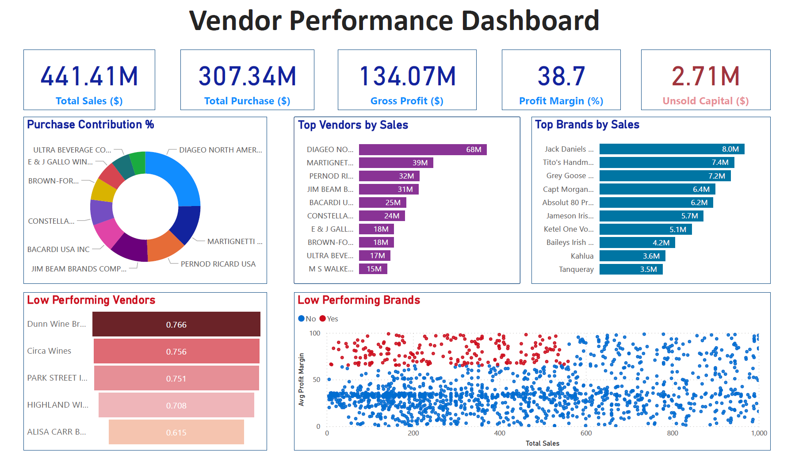

# 📊 Vendor Performance Analysis  

## 📌 Project Overview  
This project focuses on analyzing vendor and brand performance using a combination of **Python (for data analysis & EDA)** and **Power BI (for dashboard visualization)**.  
The objective is to identify **top-performing vendors**, **low-performing vendors/brands**, monitor **profit margins**, and highlight **stock inefficiencies** to support data-driven decisions in vendor management.  

---

## 🎯 Objectives  
- Evaluate vendor contribution to sales, purchases, and profitability.  
- Identify high-performing and underperforming vendors and brands.  
- Track KPIs such as **Total Sales, Purchases, Gross Profit, Profit Margin, and Unsold Capital**.  
- Provide actionable insights through an interactive dashboard.  

---

## 🛠️ Tools & Technologies  
- **Python**: Pandas, NumPy, Matplotlib, Seaborn, Plotly  
- **Jupyter Notebook**: Data exploration and documentation  
- **Power BI**: Interactive vendor performance dashboard  
- **Version Control**: Git & GitHub for project sharing  

---

## 📂 Project Structure  
vendor-performance-analysis/
│── data/ # (Optional sample dataset / dummy data)
│── notebooks/ # Jupyter notebooks for EDA & analysis
│ ├── 01_EDA.ipynb
│ ├── 02_Analysis.ipynb
│── dashboard/ # Power BI file & screenshots
│ ├── vendor_dashboard.pbix
│ ├── dashboard_screenshots/
│── reports/ # Any PDF reports (optional)
│── README.md # Project overview

---

## 🔎 Methodology  

### 1. Data Preparation  
- Cleaned vendor and brand data (handled missing values, duplicates, inconsistencies).  
- Standardized sales, purchase, and profit margin columns.  

### 2. Exploratory Data Analysis (Python)  
- Distribution of sales and purchases across vendors.  
- Gross profit and margin calculations.  
- Contribution analysis (which vendors drive most of the revenue?).  
- Identification of underperforming vendors (low sales + low margin).  

### 3. Dashboard Creation (Power BI)  
- Built KPI cards for **Total Sales, Purchases, Gross Profit, Profit Margin, Unsold Capital**.  
- Bar charts for **Top Vendors** and **Top Brands** by sales.  
- Scatter plot to highlight **Low Performing Vendors**.  
- Interactive filters for deeper insights.  

---

## 📊 Results & Insights  

**Key Metrics**  
- **Total Sales:** \$441.41M  
- **Total Purchases:** \$307.34M  
- **Gross Profit:** \$134.07M  
- **Profit Margin:** 38.7%  
- **Unsold Capital:** \$2.71M  

**Top Vendors by Sales**  
- Diageo North America  
- Martignetti  
- Pernod Ricard USA  
- Jim Beam Brands  
- Bacardi USA  

**Top Brands by Sales**  
- Jack Daniels, Tito’s Handmade, Grey Goose, Captain Morgan, Absolut, Jameson  

**Low Performing Vendors**  
- Dunn Wine, Circa Wines, Park Street, Highland Wines, Alisa Carr Brands  

---

## 📈 Dashboard Preview  

  

---

## 💡 Business Value  
- Helps procurement teams **negotiate better with high-volume vendors**.  
- Identifies **brands/vendors with poor returns** for discontinuation or renegotiation.  
- Improves **profitability monitoring and stock efficiency**.  
- Provides a **data-driven view for vendor management** decisions.  

---

## 🚀 Future Work  
- Develop a **vendor scoring system** based on multiple KPIs.  
- Build **predictive models** to forecast vendor sales.  
- Automate data pipelines with ETL for **real-time dashboard refresh**.  

---
