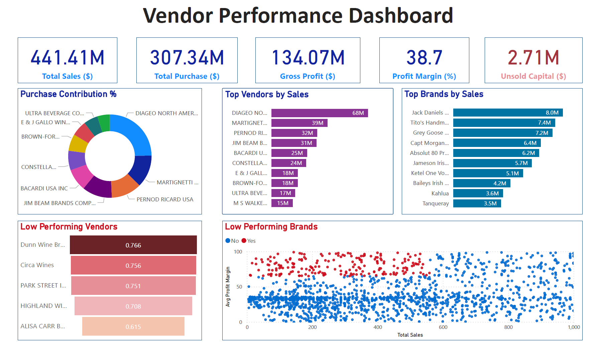

# Vendor Performance Analytics Dashboard

## 📌 Project Overview

This project is an end-to-end Vendor Performance Analytics solution designed to evaluate vendor profitability, inventory efficiency, purchasing behavior, and sales performance. The workflow follows a real-world analytics lifecycle, combining SQL, Python, and Power BI to transform raw transactional data into actionable business insights.

The goal is to help businesses optimize vendor management, improve profitability, reduce inventory holding costs, and identify strategic opportunities for growth.

---

## 🎯 Business Problem

Organizations working with multiple vendors often face challenges such as:

- Inefficient pricing strategies
- Poor inventory turnover
- Excess stock and locked capital
- Vendor dependency risks
- Difficulty identifying high-performing vendors

This project aims to answer key business questions related to vendor profitability, sales performance, inventory management, and purchasing optimization.

---

## 🛠️ Tech Stack

| Technology | Purpose |
|------------|----------|
| SQL | Data extraction, aggregation, and transformation |
| Python | Data cleaning, EDA, feature engineering, statistical analysis |
| Pandas | Data manipulation |
| NumPy | Numerical computations |
| Matplotlib / Seaborn | Data visualization |
| SQLite | Database management |
| Power BI | Dashboard creation and reporting |
| DAX | Business calculations and KPIs |

---

## 📂 Dataset

The project utilizes multiple transactional datasets:

- Purchase Transactions
- Purchase Prices
- Vendor Invoices
- Sales Transactions
- Beginning Inventory
- Ending Inventory

These datasets were imported into a SQLite database to simulate a real-world business environment.

---

## 🔄 Project Workflow

### 1. Data Ingestion

- Imported multiple CSV files into SQLite
- Automated loading process using Python
- Implemented logging and error handling
- Managed large datasets efficiently

### 2. Data Exploration

Reviewed and analyzed:

- Purchase Data
- Sales Data
- Vendor Information
- Pricing Data
- Inventory Records

### 3. SQL Data Aggregation

Created an aggregated vendor-brand summary table containing:

- Vendor Number
- Brand
- Total Purchase Quantity
- Total Purchase Dollars
- Freight Cost
- Total Sales Quantity
- Total Sales Dollars
- Purchase Price

### 4. Data Cleaning

Performed:

- Missing value treatment
- Data type corrections
- Whitespace removal
- Duplicate handling
- Data validation

### 5. Feature Engineering

Generated business KPIs:

#### Gross Profit

```text
Gross Profit = Total Sales Dollars - Total Purchase Dollars
```

#### Profit Margin

```text
Profit Margin (%) = (Gross Profit / Total Sales Dollars) × 100
```

#### Stock Turnover

```text
Stock Turnover = Total Sales Quantity / Total Purchase Quantity
```

#### Sales-to-Purchase Ratio

```text
Sales to Purchase Ratio = Total Sales Dollars / Total Purchase Dollars
```

---

## 📊 Exploratory Data Analysis (EDA)

Key findings:

- Presence of negative gross profits
- Significant outliers in purchase and sales values
- Large variation in stock turnover rates
- Inventory inefficiencies across several vendors
- Low relationship between purchase price and sales revenue

### Correlation Analysis

Insights:

- Strong positive correlation between purchase quantity and sales quantity
- Weak negative correlation between profit margin and sales price
- Minimal correlation between purchase price and sales revenue
- Inventory turnover alone does not guarantee profitability

---

## 🔍 Business Questions & Findings

### 1. Which Brands Need Promotional or Pricing Adjustments?

Criteria:

- Low Sales (<15th percentile)
- High Profit Margin (>85th percentile)

#### Findings

- 198 brands identified
- Potential candidates for promotions or pricing optimization

---

### 2. Who Are the Top Vendors and Brands?

Analysis based on:

- Total Sales Revenue

#### Findings

- Identified top-performing vendors
- Identified highest revenue-generating brands

---

### 3. Vendor Contribution Analysis

Measured:

- Percentage contribution to total purchases

#### Findings

- Top 10 vendors contributed approximately **66%** of total purchases
- Indicates significant supplier concentration

---

### 4. Does Bulk Purchasing Reduce Unit Cost?

Method:

- Segmented purchases into:
  - Small Orders
  - Medium Orders
  - Large Orders

#### Results

| Order Size | Average Unit Cost |
|------------|------------------|
| Small | ~$39 |
| Medium | ~$15 |
| Large | ~$10 |

#### Insight

Large purchases achieved approximately **72% cost savings** compared to small purchases.

---

### 5. Which Vendors Have Low Inventory Turnover?

Criteria:

```text
Stock Turnover < 1
```

#### Findings

- Identified slow-moving inventory vendors
- Highlighted opportunities for inventory optimization

---

### 6. How Much Capital Is Locked in Unsold Inventory?

Formula:

```text
Unsold Inventory Value =
(Total Purchase Quantity - Total Sales Quantity) × Purchase Price
```

#### Findings

- Approximately **$2.7 Million** tied up in unsold inventory

---

### 7. Do Top Vendors Have Better Profit Margins?

Method:

- Confidence Interval Analysis
- Vendor segmentation based on sales performance

#### Findings

- Significant differences observed between top and low-performing vendors
- Profitability patterns vary across vendor categories

---

### 8. Statistical Hypothesis Testing

#### Null Hypothesis

```text
There is no significant difference in profit margins
between top-performing and low-performing vendors.
```

#### Test Used

- Independent T-Test

#### Result

- Very low p-value
- Null hypothesis rejected

#### Conclusion

Vendor performance groups exhibit statistically significant differences in profit margins.

---

## 📈 Power BI Dashboard

### Dashboard KPIs

- Total Sales
- Total Purchases
- Gross Profit
- Profit Margin
- Unsold Inventory Value

### Visualizations

- Top Vendors by Sales
- Top Brands by Sales
- Vendor Purchase Contribution
- Low Inventory Turnover Vendors
- Promotion Opportunity Analysis
- Inventory Insights Dashboard

### Features

- Interactive filtering
- Drill-down capabilities
- Dynamic KPI cards
- Professional business reporting

---

## 💡 Key Business Recommendations

### Pricing Optimization

- Reevaluate pricing for low-selling, high-margin products
- Implement targeted promotional campaigns

### Inventory Management

- Reduce slow-moving inventory
- Improve stock turnover efficiency

### Vendor Diversification

- Reduce dependency on top vendors
- Improve supply chain resilience

### Purchasing Strategy

- Leverage bulk purchasing where feasible
- Optimize procurement costs

### Sales Growth

- Increase marketing focus on underperforming brands
- Improve distribution strategies

---

## 📷 Dashboard Preview



## 🚀 Project Outcomes

✔ Built a production-style analytics workflow

✔ Integrated SQL, Python, and Power BI

✔ Performed large-scale data aggregation and analysis

✔ Generated actionable business recommendations

✔ Created stakeholder-ready dashboards and reports

✔ Demonstrated real-world business problem solving

---

## 📁 Project Structure

```text
Vendor-Performance-Analytics/
│
├── data/
│   ├── purchases.csv
│   ├── sales.csv
│   ├── vendor_invoice.csv
│   └── purchase_prices.csv
│
├── sql/
│   ├── data_extraction.sql
│   ├── aggregation_queries.sql
│   └── summary_table.sql
│
├── notebooks/
│   ├── data_cleaning.ipynb
│   ├── eda.ipynb
│   └── statistical_analysis.ipynb
│
├── dashboard/
│   └── Vendor_Performance.pbix
│
├── reports/
│   └── Business_Insights_Report.pdf
│
├── images/
│   └── dashboard_screenshots/
│
├── README.md
│
└── requirements.txt
```

---

## 👤 Author

**Meghana D A**

- MSc Data Science (Distinction)
- Data Analyst | Data Scientist
- SQL | Python | Machine Learning | Power BI | Statistics

---

## ⭐ If you found this project useful, consider giving it a star!
